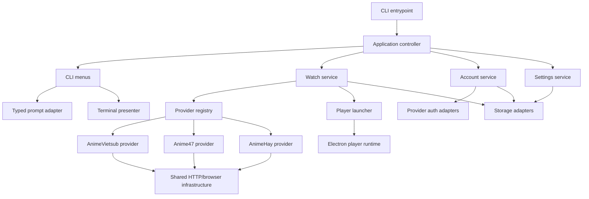

# NekoStream CLI Cleanup Plan

## Mục tiêu

Làm sạch codebase theo hướng chuyên nghiệp, dễ đọc, dễ kiểm thử và an toàn khi phát hành mà không làm thay đổi hành vi scraper/player ngoài ý muốn.

Các nguyên tắc thực hiện:

- Refactor theo từng phase nhỏ, luôn giữ build chạy được.
- Ưu tiên sửa quy trình build, package và type safety trước khi tách logic lớn.
- Tách thay đổi formatting khỏi thay đổi hành vi.
- Viết test cho parser trước khi di chuyển logic provider.
- Không refactor nhiều provider trong cùng một bước.
- Không chỉnh sửa hoặc commit dữ liệu runtime và tài liệu không liên quan khi chưa xác nhận.

## Baseline đã xác nhận

- Quy mô codebase: hơn 11.000 dòng TypeScript/JavaScript/HTML/CSS.
- `npm run build`: pass.
- Diagnostics TypeScript: không có lỗi hoặc warning.
- `npx tsx checks/search-check.mts`: pass.
- `npm pack --dry-run`: chạy được nhưng phát hiện artifact cũ và thiếu runtime asset.
- `DESIGN.md` đang untracked và có nội dung không khớp cấu trúc dự án hiện tại; giữ nguyên cho đến khi xác nhận mục đích.

## Các vấn đề chính

### P0 — Build và npm package

1. `dist` không được xóa trước build, khiến artifact cũ như `dist/server/**` lọt vào package.
2. `webview-preload.js` được player sử dụng nhưng chưa nằm trong danh sách file publish.
3. Code import trực tiếp `@electron/get`, `extract-zip` và `undici` nhưng chưa khai báo dependency trực tiếp.
4. `eruda` được dùng tại runtime nhưng đang nằm trong `devDependencies`.
5. `package.json` và `package-lock.json` đang lệch version.
6. Chưa có package smoke check tự động.

### P0 — Repository hygiene

1. `.data/auth-sessions.json`, `.data/history.json` và `.data/settings.json` đang được Git theo dõi.
2. Runtime hiện đã chuyển sang `~/.nekostream-cli`; `.data` chỉ còn vai trò migration legacy.
3. Cần bỏ track dữ liệu runtime nhưng không xóa file local của người dùng.
4. Cần xác minh riêng mục đích của `issues.json` trước khi bỏ track.

### P1 — CLI orchestration

`index.ts` đang quản lý bootstrap, update, menu, settings, history, account, watch flow, Discord và process lifecycle.

Hotspot:

| Hàm                         | Kích thước xấp xỉ |
| --------------------------- | ----------------: |
| `main()`                    |          224 dòng |
| `openAnimeMenu()`           |          162 dòng |
| `showSettingsMenu()`        |          125 dòng |
| `showProviderAccountMenu()` |          105 dòng |

Mục tiêu:

- `index.ts` dưới 100 dòng.
- Mỗi menu thành module riêng.
- Tách watch flow khỏi presentation.
- Tạo helper quản lý spinner và lỗi nhất quán.

### P1 — Type safety

1. Nhiều `any` ở prompt choices, provider ID và list action.
2. `source`/`provider` đang dùng `string` tự do.
3. Provider/account/list actions chưa được model bằng union type.
4. Test phải cast provider thành `any` để monkey-patch private method, cho thấy dependency injection chưa tốt.

Mục tiêu:

```ts
export const PROVIDER_IDS = ['animevietsub', 'anime47', 'animehay'] as const

export type ProviderId = (typeof PROVIDER_IDS)[number]
```

Sau đó áp dụng vào registry, settings, history, auth và CLI actions.

### P1 — Provider registry

`providers.ts` tạo singleton global rồi mutate `baseUrl` trong `getProvider()`. Logic domain normalization cũng bị lặp ở nhiều nơi.

Mục tiêu:

- Registry chứa metadata và factory.
- Resolve domain ở một nơi duy nhất.
- Hạn chế mutable global state.
- Chuẩn hóa provider ID, label và default URL.

### P1 — Provider lớn

#### AnimeVietsub

`scrapers/providers/animevietsub.ts` gần 2.000 dòng, đang trộn domain fallback, HTTP, Playwright, parser, schedule, episode, server và stream extraction.

Cấu trúc mục tiêu:

```text
providers/animevietsub/
  animevietsub-provider.ts
  config.ts
  client.ts
  domain-resolver.ts
  parsers/
    cards.ts
    detail.ts
    episodes.ts
    schedule.ts
  streams/
    server-parser.ts
    du-extractor.ts
    hdx-extractor.ts
    playwright-extractor.ts
```

#### Anime47

Tách API types, client, parser và stream extractor khỏi provider class.

#### AnimeHay

Đã quyết định **abandon**: giữ code cho provider vẫn chạy được, nhưng ngừng đầu tư.

- Không viết fixture test.
- Không refactor trong Phase 3/4.
- 676 dòng trong `scrapers/providers/animehay.ts` được giữ nguyên tại chỗ.
- Tồn đọng đã biết, chấp nhận không sửa: `storage.ts` khai báo domain `https://animehay.ink` còn `scrapers/providers/animehay.ts` khai báo `https://animehay01.site` — hai nguồn sự thật khác nhau cho cùng một provider.
- Tồn đọng đã biết: identifier `configureAnimehаyCacheHooks` có ký tự Cyrillic trong tên.

Trước đây AnimeHay được chọn làm provider refactor đầu tiên vì nhỏ nhất. Quyết định này **thay thế** kế hoạch đó.

### P1 — Auth subsystem

`scrapers/auth-service.ts` hơn 1.200 dòng và chứa logic của nhiều provider.

Cấu trúc mục tiêu:

```text
auth/
  auth-types.ts
  auth-session-service.ts
  browser-login.ts
  browser-policy.ts
  animevietsub/
    login.ts
    lists.ts
    notifications.ts
    parsers.ts
  anime47/
    login.ts
    client.ts
    lists.ts
    notifications.ts
    stream-interceptor.ts
```

### P1 — Electron player

`player-main.js` có `createWindow()` hơn 300 dòng và đang dùng:

```js
nodeIntegration: true
contextIsolation: false
webSecurity: false
webviewTag: true
```

Ngoài ra player xóa CSP/X-Frame-Options, inject JavaScript, dùng persistent session và ghi DOM dump trong runtime.

Mục tiêu:

- Tách window/session/request policy/frame injection.
- Bật `contextIsolation` và tắt Node integration ở renderer chính.
- Chỉ expose IPC tối thiểu qua preload/context bridge.
- Validate IPC sender và stream payload.
- Dùng hostname allowlist thay cho `url.includes()`.
- Chỉ ghi DOM dump khi debug mode được bật rõ ràng.
- Gom ad-block policy về một nguồn duy nhất.

### P2 — Storage

`storage.ts` đang chứa settings, history, auth encryption và migration side effect khi import.

Cấu trúc mục tiêu:

```text
infrastructure/storage/
  paths.ts
  json-store.ts
  settings-store.ts
  history-store.ts
  auth-session-store.ts
  encryption.ts
  migrate.ts
```

Nâng cấp mã hóa auth session từ AES-CBC không có integrity tag sang AES-GCM hoặc keychain hệ điều hành. Không fallback im lặng sang plain base64.

### P2 — Shared scraping infrastructure

Chuẩn hóa các phần đang lặp:

- HTTP timeout/retry.
- User-Agent/browser profile.
- Playwright launch/context.
- Cookie injection.
- Ad blocking.
- HTML decode.
- URL normalization.
- Error classification.

Cấu trúc mục tiêu:

```text
scraping/
  http-client.ts
  retry.ts
  timeout.ts
  browser-factory.ts
  browser-profile.ts
  cookies.ts
  html.ts
  urls.ts
  errors.ts
```

### P2 — Logging và error handling

Tạo error taxonomy:

- `ProviderUnavailableError`
- `AuthenticationRequiredError`
- `RateLimitedError`
- `BlockedRequestError`
- `StreamNotFoundError`
- `PlayerRuntimeError`
- `StorageError`

CLI presenter chịu trách nhiệm chuyển lỗi thành thông báo người dùng; logger nhận structured context.

### P2 — Test strategy

1. Unit test utility thuần.
2. HTML fixture tests cho parser từng provider. **Đã làm ở Phase 2.5** cho AnimeVietsub và Anime47; AnimeHay bỏ qua theo quyết định abandon.
3. Provider contract tests.
4. Package smoke test sau build.
5. Player policy tests cho payload, host allowlist, cookie và IPC.

### P2 — Formatting và quality tooling

Thêm:

- `.editorconfig`
- Prettier
- ESLint
- `clean`, `format`, `lint`, `typecheck`, `test`, `check`, `pack:check`
- CI chạy trên clean checkout

Không format toàn codebase trong cùng commit với refactor logic.

### P3 — Documentation và polish

- Sửa metadata `package.json`.
- Mở rộng README với screenshot, capability matrix, architecture, troubleshooting và privacy note.
- Thêm architecture document và provider contribution guide.
- Xác minh `DESIGN.md` trước khi đưa vào repository.

## Kiến trúc mục tiêu



## Roadmap triển khai

### Phase 0 — Baseline và repository hygiene

- [x] Thêm clean build.
- [x] Đồng bộ manifest và lockfile.
- [x] Khai báo dependency runtime trực tiếp.
- [x] Đưa đủ player asset vào npm package.
- [x] Thêm package smoke check.
- [x] Bỏ track `.data` nhưng giữ file local.
- [x] Thêm EditorConfig, Prettier và ESLint.
- [x] Thêm scripts `typecheck`, `test`, `lint`, `check`.
- [x] Thêm CI.

Tiêu chí hoàn thành:

- Build từ checkout sạch.
- Tarball không chứa artifact cũ.
- Tarball có đủ player assets.
- Build, lint, typecheck và checks pass.
- Không còn runtime data trong Git index.

### Phase 1 — Type foundation

- [x] Tạo `ProviderId` và provider metadata.
- [x] Tạo union type cho account/list/home actions.
- [x] Typed prompt choices.
- [x] Loại `any` trong luồng CLI chính.
- [x] Chuẩn hóa error helper và spinner helper.

### Phase 2 — Tách CLI

- [x] Tách settings menu.
- [x] Tách history menu.
- [x] Tách account menu.
- [x] Tách anime/watch flow.
- [x] Thu nhỏ `index.ts` thành bootstrap/lifecycle.

Tiến độ hiện tại:

- `index.ts` chỉ còn quản lý lifecycle và gọi application controller.
- `cli/application.ts` nay chỉ còn bootstrap runtime service rồi bàn giao cho home menu.
- Luồng CLI được tách theo hai nhóm module:

```text
cli/
  application.ts        # bootstrap + bàn giao cho home menu
  feedback.ts           # sleep, spinner wrapper, error/empty reporter
  update-check.ts       # kiểm tra và cài đặt bản mới
  menus/
    home-menu.ts        # vòng lặp chính, sở hữu state provider hiện tại
    settings-menu.ts
    history-menu.ts
    account-menu.ts
  flows/
    anime-flow.ts       # watch flow: chọn tập, chọn server, phát
    provider-lists.ts   # fetch danh sách/thông báo theo provider
    auth-flow.ts        # đăng nhập dùng chung
```

- Logic fetch danh sách provider và luồng đăng nhập trước đây bị lặp giữa account menu và home menu, nay dùng chung qua `flows/provider-lists.ts` và `flows/auth-flow.ts`.

### Phase 2.5 — Fixture test cho parser

Nguyên tắc của kế hoạch là "viết test cho parser trước khi di chuyển logic provider", nhưng roadmap ban đầu không có bước nào thực hiện việc đó. Phase này lấp chỗ trống và là điều kiện tiên quyết của Phase 3/4.

- [x] Thêm `checks/capture-fixtures.mts` — tool dev-only, chạy tay, hit site thật để lấy HTML.
- [x] Commit HTML fixture để test chạy offline.
- [x] Thêm `checks/parser-check.mts` — test parser hoàn toàn offline.
- [x] Nối `parser-check` vào `npm test`.
- [x] Xác minh test thật sự fail khi parser hỏng (mutation check bằng trang rỗng).

Fixture hiện có:

```text
checks/fixtures/
  animevietsub/
    home-latest.html
    detail.html
    episodes.html
  anime47/
    home-latest.html
```

Ràng buộc thiết kế:

- `capture-fixtures.mts` **không** nằm trong `npm test`. Test parser phải offline và deterministic.
- Capture chặn trang Cloudflare challenge ghi đè fixture tốt (`looksLikeHtml`), và mỗi target độc lập — lỗi thì skip chứ không abort cả run.
- `parser-check.mts` override `globalThis.fetch` để throw, đảm bảo không có call mạng nào lọt qua (`getAnimeDetail` gọi `enrichWithAniList`, vốn non-throwing nên sẽ âm thầm ra mạng).
- Assertion mang tính **cấu trúc**, không so khớp chính xác: fixture là snapshot site thật nên title/số tập đổi mỗi lần recapture. Điều bất biến là shape — card có id và title, id không trùng, số tập dương và sắp tăng, URL absolute.
- Fixture không được publish lên npm (đã xác minh qua `pack:check`).

Không capture được, có lý do:

- Anime47 search đi qua JSON API, không có HTML để record.
- AnimeVietsub `/tim-kiem/` bị challenge-gate liên tục.
- Search ranking đã được `checks/search-check.mts` phủ bằng card tổng hợp.

Bug thật phát hiện nhờ fixture:

- `Anime47.getHomeCards('latest')` luôn trả về rỗng. Homepage là Quasar SPA và không còn ship `__INITIAL_STATE__` — nguồn duy nhất set `status`. Toàn bộ 59 card đến từ đường HTML và không có `status`, nên filter theo `status` xóa sạch kết quả. Đã sửa bằng cách fallback về danh sách chưa filter, và pin lại bằng assertion.

### Phase 3 — Shared scraping infrastructure

- [ ] HTTP client/retry/timeout.
- [ ] URL/HTML helpers.
- [ ] Browser factory/profile.
- [ ] Cookie injection.
- [ ] Shared request/ad-block policy.
- [ ] Provider error mapping.

### Phase 4 — Refactor provider

Thứ tự (chỉ còn hai provider — AnimeHay đã abandon):

1. AnimeVietsub.
2. Anime47.

Mỗi provider:

- [ ] Extract pure parsers.
- [ ] Mở rộng fixture tests cho phần vừa tách (baseline đã có từ Phase 2.5).
- [ ] Extract HTTP/browser client.
- [ ] Extract stream handlers.
- [ ] Thu nhỏ provider class.
- [ ] Chạy contract tests.

Fixture test của Phase 2.5 là lưới an toàn cho phase này: chạy `npm test` sau mỗi bước tách để phát hiện parser bị lệch hành vi. Vì assertion là structural, nó bắt được lỗi "parser trả về rỗng/sai shape" chứ không bắt được thay đổi nội dung nhỏ — với những phần đó cần thêm assertion cụ thể khi tách.

Dead code cần dọn khi refactor (ESLint không thấy vì `no-unused-vars` đang tắt; phát hiện bằng `npx tsc --noEmit --noUnusedLocals --noUnusedParameters`):

- `scrapers/providers/anime47.ts` — `fetchWatchDataByApi`, `inferStreamTypeFromUrl`.
- `scrapers/providers/animevietsub.ts` — import `pickRandomProfile`, biến `hostname`.
- `scrapers/auth-service.ts` — `buildAvsHeaders`, `A47_API` (thuộc Phase 5).
- `scrapers/interceptor.ts` — tham số `timeout`.
- `cli/menus/account-menu.ts` — export `showAccountMenu` không còn ai gọi; cần xác nhận trước khi xóa.

### Phase 5 — Auth subsystem

- [ ] Shared auth types.
- [ ] Shared Playwright login infrastructure.
- [ ] AnimeVietsub auth adapter.
- [ ] Anime47 auth adapter.
- [ ] Lists/notifications services.
- [ ] Session storage integration.

### Phase 6 — Player hardening

- [ ] Tổ chức lại player assets.
- [ ] Tách `createWindow()`.
- [ ] Context bridge.
- [ ] Tắt Node integration ở renderer.
- [ ] Validate IPC và payload.
- [ ] Host allowlist chính xác.
- [ ] Debug dump opt-in.
- [ ] Centralize request/ad-block policy.
- [ ] Package/player smoke tests.

### Phase 7 — Documentation và polish

- [ ] README chuyên nghiệp.
- [ ] Architecture document.
- [ ] Provider contribution guide.
- [ ] Release checklist.
- [ ] Security/privacy documentation.
- [ ] Naming và copywriting audit.

## Thứ tự commit đề xuất

1. `Add project quality checks`
2. `Clean npm package artifacts`
3. `Remove tracked runtime data`
4. `Add shared provider types`
5. `Extract CLI settings menu`
6. `Extract CLI account menu`
7. `Extract anime watch flow`
8. `Add parser fixture tests`
9. `Add shared scraper utilities`
10. `Refactor Anime47 provider`
11. `Refactor AnimeVietsub provider`
12. `Split provider auth services`
13. `Harden Electron player`
14. `Polish project documentation`

`Refactor AnimeHay provider` đã bị loại khỏi danh sách theo quyết định abandon.

## Validation bắt buộc sau mỗi phase

```bash
npm run lint
npm run typecheck
npm test
npm run build
npm run pack:check
```

Với thay đổi provider/player, cần thêm smoke test thực tế trên provider liên quan trước khi phát hành.
